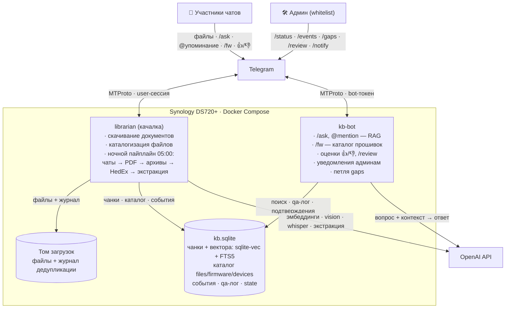

# firmware-librarian

> Бывший `telegram-file-downloader` — проект перерос имя: теперь это
> библиотекарь прошивок и документации с RAG-ботом поверх истории чатов.

Два сервиса в одном docker-compose на NAS Synology DS720+:

1. **Качалка** — Telethon user-клиент: слушает выбранные Telegram-чаты, скачивает
   документы с нужными расширениями, дедуплицирует их по имени + MD5 и складывает
   на том NAS. Раз в сутки инжестит историю чатов в базу знаний.
2. **kb-bot** — «хранитель знаний»: Telegram-бот, отвечающий на вопросы в чате
   (`/ask` и `@упоминание`) по истории этого же чата — RAG на sqlite-vec + FTS5
   с генерацией ответа через OpenAI API.

## Архитектура



Диаграммы as-code — в [architecture.likec4](architecture.likec4)
(смотреть: расширение LikeC4 для VS Code или `npx likec4 start`).

Ключевые решения:

- **Одна Telethon-сессия = один процесс.** Второе подключение с тем же
  `bot.session` убивает первое, поэтому ночной ingest живёт внутри процесса
  качалки, а бэкфилл запускается только при остановленной качалке.
- **Ответы — от отдельного бота, не от личного аккаунта**: автоответы с
  user-аккаунта — риск бана.
- **Чанк — фрагмент беседы**, не сообщение: сообщения топика группируются до
  паузы >30 минут или ~4000 символов, с сохранением имени топика и ссылок.
- **Гибридный поиск**: KNN по векторам (sqlite-vec) + полнотекстовый (FTS5,
  ловит артикулы вроде «MA5608T»), слияние через Reciprocal Rank Fusion.
- **Каталог прошивок — сначала детерминированно, потом LLM**: имена файлов
  разбираются регулярками бесплатно; LLM подключается только там, где имя
  не говорит (подписи к постам, таксономия серий) и всегда с подтверждением
  админа (`/review`).
- **Человек в петле**: всё, что извлёк LLM, помечено «не подтверждено» до
  решения админа; плохие ответы (👎) не ретраятся автоматически.
- **Переезд на Qdrant заложен**: весь доступ к базе — через `kb_store.open_store()`
  (`KB_BACKEND`), вектора хранятся в базе, id чанков детерминированы.

## Быстрый старт

Требования: Docker + Compose V2, аккаунт Telegram, `api_id`/`api_hash`
с [my.telegram.org](https://my.telegram.org), ключ OpenAI (для базы знаний),
бот из BotFather (для ответов).

1. **Сессия Telegram** (один раз, локально с tty):

   ```sh
   pip install -r requirements.txt
   python librarian.py   # спросит телефон и код — появится bot.session
   ```

   Полученный `bot.session` должен лежать рядом с `Dockerfile` — он копируется
   в образ, чтобы контейнер стартовал без интерактива.

2. **Переменные окружения**:

   ```sh
   cp .env.example .env    # и заполнить
   ```

3. **Бот для ответов** (если нужна база знаний): BotFather → `/newbot` → токен
   в `.env`; `/setprivacy` → **Disable** (иначе бот не видит упоминания);
   добавить бота в рабочий чат.

4. **Деплой**:

   ```sh
   ./redeploy.sh
   ```

5. **Бэкфилл истории в базу знаний** (один раз; качалку остановить — общая сессия):

   ```sh
   docker compose stop librarian
   docker compose run --rm librarian python kb_backfill.py --dry-run   # оценка объёма и цены
   docker compose run --rm librarian python kb_backfill.py             # сам бэкфилл
   docker compose start librarian
   ```

   Бэкфилл идемпотентен: прерванный прогон можно перезапускать, уже записанные
   чанки не переэмбеддятся. Идёт тремя этапами: **[1/3] текст** (минуты — после
   этого база уже отвечает на вопросы), **[2/3] медиа** (vision/whisper — самый
   долгий и дорогой этап), **[3/3] обновление чанков** описаниями медиа.

## Как работает база знаний

- **Ночной ingest**: каждый день в `INGEST_HOUR` (по `TZ` контейнера) качалка
  читает новые сообщения чатов `KB_CHAT_IDS` от сохранённого `last_seen_id`,
  режет на чанки, эмбеддит и пишет в `kb.sqlite`. Пропущенный запуск
  догоняется автоматически. Дальше идёт общий пост-инжест конвейер
  (`kb_pipeline.py` — единственное место, где задан порядок шагов): каталог →
  PDF → архивы → HedEx → LLM-экстракция → бэкап. Его же переиспользует
  бэкфилл, поэтому шаги не расходятся между ночным джобом и ручным прогоном.
  Что происходит прямо сейчас, видно в `/status` — длинные шаги идут часами.
- **Ответ на вопрос**: бот расширяет вопрос (LLM разворачивает сленг в
  термины + английский вариант), ищет по всем формулировкам (гибрид,
  RRF-слияние) → chat completion с контекстом → ответ в тот же топик со
  ссылками-цитатами `t.me/c/…`. Кулдаун — 30 секунд на пользователя.
- **Диалог**: ответьте реплаем на сообщение бота — он продолжит разговор,
  подтянув цепочку предыдущих вопросов и ответов в промпт и в поиск (уточнения
  вроде «а на R024?» сами по себе сущностей не несут — их держит контекст).
  Ни `/ask`, ни упоминание для этого не нужны.
- **Где бот живёт**: в форуме его можно запереть в конкретных топиках
  (`KB_ANSWER_CHAT_IDS=<чат>:<топик>`) — ограничение накрывает и вопросы, и
  `/fw`, `/sw`, `/download` с их файлами. С `KB_CLEANUP_MINUTES` бот убирает
  за собой служебные сообщения (каталожные простыни, подсказки) и команды
  пользователей; ответы на вопросы не удаляются никогда.
- **Веб-поиск (`KB_WEB=1`)**: ответы могут дополняться поиском в интернете
  (официальные доки Huawei, release notes, CVE) — опыт чата приоритетен,
  веб-источники идут отдельным блоком 🌐. Если базе нечего сказать, бот
  ответит из веба, честно об этом сообщив.
- **Самообучение на пробелах**: вопросы без ответа копятся; раз в неделю
  (пн 10:00, если задан `KB_GAPS_CHAT_ID`) бот постит топ-3 в чат — «помогите
  сообществу». Обсуждение подбирает ночной инжест, а утром (через час после
  инжеста) бот **сам отвечает реплаем** авторам вопросов, на которые раньше
  не знал ответа. Вопросы с 👎 автоматически не ретраятся — только вручную
  через `/gaps`.
- **Стоимость**: на реальном корпусе владельца (185 тыс. чанков: история чатов,
  16 пакетов HedEx и 327 архивов) полный переэмбеддинг стоит ~$0.04 на
  `BAAI/bge-m3` через DeepInfra; ответ на вопрос — десятые доли цента; суточный
  ingest — копейки. Поиск по такой базе занимает ~0.6 с.

### Обогащение медиа (опционально)

Флаги в `.env`, по умолчанию всё выключено:

| Флаг | Что даёт | Цена |
|---|---|---|
| `KB_VISION=1` | картинки → vision-модель: описание + OCR (скриншоты консоли, шильдики, схемы) | ~$0.004/шт |
| `KB_VOICE=1` | голосовые → Whisper: транскрипция | ~$0.006/мин |
| `KB_PDF=1` | текстовый слой скачанных PDF из папки загрузок | только эмбеддинги, копейки |
| `KB_HEDEX=1` | документация HedEx: `.hdx`-пакеты из папки загрузок, чанк = страница, бот цитирует «документация: продукт версия — раздел»; одинаковые страницы разных версий индексируются один раз | только эмбеддинги (~$0.15 за пару полных пакетов на DeepInfra) |
| `KB_ARCHIVE=1` | архивы (zip/rar/7z/tar): листинг в базу, связки прошивок по именам внутри (`/fw` находит сборки по содержимому), pdf/docx/xlsx/txt/html из архивов — в RAG (потоково, в память), `.hdx` извлекается для KB_HEDEX | эмбеддинги — копейки; первый прогон большой папки — часы IO |

Видео сознательно не обрабатываются (дорого, низкая плотность пользы).
Сканы PDF без текстового слоя пропускаются (OCR не делаем).
Картинки-файлы в экзотических форматах (BMP/TIFF…) автоматически
конвертируются в JPEG; неконвертируемое (HEIC) пропускается без ретраев.
В чанках медиа всегда отмечено плейсхолдером `[изображение]`/`[голосовое]` —
включение флагов потом лишь обогащает чанки описаниями, без дубликатов.

### Каталог прошивок: /fw

Бот каталогизирует **все документы** из наблюдаемых чатов (включая те
расширения, что не скачиваются) и детерминированно разбирает имена файлов
Huawei: модель + версия `V-R-C-SPC` (парсер откалиброван по реальному
журналу: 84% имён дают модель+версию). Тип файла определяется автоматически
(софт/патч/доки/release notes/MIB); PGP-подписи (`.asc/.p7s`) в выдачу
не попадают.

**`/fw` без аргумента — навигация как на support.huawei.com**: раздел
(Коммутаторы/WLAN/Роутеры/СХД/…) → модель → ветка версий (V600 R025) →
файлы по типам с кнопками 📎. Всё на inline-кнопках, с пагинацией.

**`/sw <модель>`** — семантическая сводка по схеме имён Huawei
(`продукт_Vxxx Rxxx Cxx SPCxxx`): ветки системного софта V+R с подписью ОС
(V200 = VRP, V600 = YunShan OS). Бандлы вида `CE6800-8800-9800` разложены
на серии.

Выдача `/fw <модель>` и `/sw` устроена одинаково: запрошенная модель —
первой, софт по веткам от новых к старым (💿 образ + 🩹 патчи: R025, затем
R024…), а документация/release notes/MIB — одним блоком 📖 в конце с
пометкой ветки.

**`/download <начало имени>`** — когда парсер бессилен: все скачанные файлы
с этим префиксом отправляются в чат последовательно, включая PGP-подписи
`.asc`/`.p7s` и многотомные архивы (до 12 за раз).

```
/fw 5735        → S5735-L: V200R019C00SPC500 — последняя · 2026-03-12 · <файл> → t.me/c/…
/fw MA5608T     → все версии по модели, свежие первыми
```

Ссылки ведут на исходные посты, а для файлов, физически скачанных качалкой
на NAS, под ответом появляются кнопки **📎 — бот присылает файл прямо в чат**
(MTProto, до 2 ГБ). Каталог наполняется тремя путями: живой захват качалкой,
ночной инжест, бэкфилл истории — последний каталогизирует документы **всех**
чатов качалки, включая не входящие в `KB_CHAT_IDS` (без инжеста в RAG).
Работает и в группе, и в личке админа.

Если точный поиск ничего не нашёл, запрос уходит **LLM-fallback'у**: модель
матчит его к известным моделям каталога и к именам файлов напрямую —
«/fw S5735-S-V2» найдёт файл с новой схемой имени без правки кода. Такая
выдача явно помечена «подобрано LLM — сверь модель в имени файла».
Версия в запросе («/fw S5735 R025») работает фильтром по версии.

Файлы, лежащие в папке загрузок **без сообщения-источника в чате** (пост
удалили, файл положили руками), тоже попадают в каталог — из журнала
дедупликации. У них нет ссылки на пост, но `/fw` их находит, и 📎 работает.

**Фаза B (LLM, копейки за ночь):** файлы с неговорящими именами
(`fw_new_final2.zip`) разбираются по подписи к посту; для моделей строится
карта серий (S5735-L ∈ S5700). Запрос `/fw S5735` покажет и прошивки
«для всей серии S5700» с явной пометкой — совместимость проверяй по release
notes. Всё, что извлёк LLM, помечено «не подтверждено», пока админ не
подтвердит через `/review` (кнопки ✅/❌ в личке); ночью бот присылает
событие «N записей ждут подтверждения».

### Оценки ответов и карта дыр

Под каждым ответом бота — кнопки 👍/👎. Все вопросы-ответы логируются;
👎 немедленно уходит событием админу в личку. Вопросы, на которые база не
ответила или ответила плохо, копятся и доступны админу по `/gaps` — это
готовый список «чего долить в базу» (спросить экспертов в чате, добавить доки).

### Админ-канал в Telegram

Укажи свой telegram id в `KB_ADMIN_IDS` (узнать: @userinfobot) и один раз нажми
Start в личке бота — бот не может написать первым. После этого:

- **Уведомления в личку** о событиях: скачанные файлы, результаты ночного
  инжеста со стоимостью, завершение бэкфилла, ошибки. Рассылка раз в минуту,
  `/notify off` выключает (события копятся и доступны через `/events`).
- **Команды** (только в личке, только для id из whitelist):
  `/status` — размер базы, каталог, деньги, статистика вопросов (+кнопка
  «▶️ Инжест сейчас»); `/events` — последние 20 событий; `/gaps` — вопросы
  без ответа; `/fw <модель>`; `/review` — подтверждение LLM-связок каталога;
  `/ingest` — внеплановый инжест, не дожидаясь ночи; `/notify on|off`.
- Любой другой текст в личке админа — обычный вопрос к базе знаний (без `/ask`).

Личные сообщения всех, кто не в whitelist, бот молча игнорирует.

### Контроль бюджета

- **До запуска**: `kb_backfill.py --dry-run` печатает разбивку по категориям —
  сколько сообщений/картинок/минут голоса/страниц PDF и ориентировочную цену
  каждой с учётом включённых флагов.
- **Во время**: бэкфилл печатает прогресс и накопленную стоимость
  (`медиа: 120 обработано, потрачено ~$0.48`).
- **Потолок**: `kb_backfill.py --max-cost 10` остановит прогон при достижении
  $10. Это безопасно: результаты vision/whisper кэшируются в базе
  (`media_cache`), записанные чанки остаются — после пополнения баланса
  повторный запуск продолжит с места остановки **без двойной оплаты**.

Отладка поиска без LLM и без Telegram:

```sh
docker compose run --rm librarian python kb_search.py "как прошить ONT"
```

Selftest хранилища (без сети вообще): `python kb_store.py`.

## Шпаргалка

| Действие | Команда |
|---|---|
| Передеплой | `./redeploy.sh` |
| Логи | `docker compose logs -f` |
| Рестарт только бота | `docker compose restart kb-bot` |
| Выключить бота | `docker compose stop kb-bot` |
| Бэкфилл | см. «Быстрый старт», шаг 5 |
| Поиск по базе | `docker compose run --rm librarian python kb_search.py "вопрос"` |

## Переменные окружения

Шаблон с комментариями — [.env.example](.env.example).

| Переменная | Обязательна | Что делает |
|---|---|---|
| `TELEGRAM_API_ID` / `TELEGRAM_API_HASH` | да | доступ к MTProto |
| `CHAT_IDS` | да | CSV чатов, откуда качать файлы |
| `FILE_EXTENSIONS` | нет (`pdf,jpg,png`) | CSV расширений без точки |
| `TZ` | нет (`UTC`) | часовой пояс; от него зависит `INGEST_HOUR` |
| `MTPROXY_HOST` / `PORT` / `SECRET` | нет | MTProto-прокси для всех подключений к Telegram (секрет hex/dd, FakeTLS ee… не поддерживается) |
| `OPENAI_API_KEY` | для KB | эмбеддинги и ответы |
| `KB_CHAT_IDS` | для KB | CSV чатов-источников знаний |
| `KB_BOT_TOKEN` | для KB | токен бота из BotFather |
| `KB_ANSWER_CHAT_IDS` | для KB | чаты, где бот отвечает; запись `<чат>` или `<чат>:<топик>` — в форуме бот живёт только в указанных топиках |
| `KB_ADMIN_IDS` | нет | CSV id админов: команды в личке + уведомления |
| `KB_GAPS_CHAT_ID` / `KB_GAPS_TOPIC_ID` | нет | еженедельный пост вопросов без ответа |
| `KB_VISION` / `KB_VOICE` / `KB_PDF` | нет (0) | обогащение: картинки / голосовые / PDF |
| `KB_HEDEX` | нет (0) | инжест документации HedEx (.hdx в папке загрузок) |
| `KB_ARCHIVE` | нет (0) | просмотр архивов: каталог по содержимому + текст в RAG |
| `EMBED_MODEL` / `EMBED_DIM` | нет (`text-embedding-3-small` / 512) | модель эмбеддингов |
| `EMBED_API_BASE` / `EMBED_API_KEY` | нет | OpenAI-совместимый провайдер только для эмбеддингов (DeepInfra и т.п.) |
| `ANSWER_MODEL` / `KB_VISION_MODEL` | нет (`gpt-5-mini`) | модели ответов и vision |
| `INGEST_HOUR` | нет (5) | час ночного инжеста |
| `KB_WEB` | нет (0) | веб-поиск при ответах (Responses API + web_search) |
| `KB_CLEANUP_MINUTES` | нет (0) | через сколько минут убирать служебные сообщения бота в группе |
| `KB_BACKUP_DAYS` | нет (7) | как часто делать резервную копию базы (`VACUUM INTO`) |
| `EMBED_PRICE_PER_MTOK` | нет | цена эмбеддингов для оценок бюджета, если модель не из встроенной карты |

Все KB-переменные опциональны: без них качалка работает как раньше, kb-bot
ждёт конфигурацию, не падая.

## Устойчивость

- Telethon: `connection_retries=-1`, `retry_delay=300` — бесконечные реконнекты
  с 5-минутной паузой; поверх — exponential backoff 300→1800 с в обоих сервисах.
- Логи Telethon приглушены до WARNING (иначе журнал заваливается служебными
  `Got difference…`).
- `restart: unless-stopped` у обоих контейнеров; логи Docker ограничены
  10 МБ × 3 файла на контейнер.
- Оборванные загрузки файлов удаляются; state инжеста двигается только после
  успешной записи.

## Безопасность

- **`bot.session` — это полный доступ к Telegram-аккаунту владельца.**
  Файл в `.gitignore` и никогда не попадает в репозиторий. При этом он обязан
  лежать в каталоге сборки на хосте (Dockerfile копирует его в образ) — на новый
  хост переносится вручную, не через git.
- Тексты чатов `KB_CHAT_IDS` отправляются в OpenAI (контекст ответов,
  vision/whisper) и эмбеддинг-провайдеру из `EMBED_API_BASE` (по умолчанию
  тот же OpenAI) — участников это устраивает by design.
- Имена скачиваемых файлов санитизируются (path traversal невозможен).

## Структура репозитория

```
librarian.py                качалка + ночной kb-ingest
kb_pipeline.py              общий пост-инжест конвейер (ночной джоб + бэкфилл)
tg_conn.py                  опциональный MTProto-прокси (MTPROXY_*)
kb_store.py                 хранилище: sqlite-vec + FTS5 + RRF (+selftest)
kb_ingest.py                чанкер, vision/whisper-обогащение, эмбеддинги
kb_firmware.py              каталог прошивок: разбор имён Huawei (/fw)
kb_extract.py               фаза B: LLM-экстракция из подписей, серии, /review
kb_pdf.py                   инжест текстового слоя скачанных PDF (KB_PDF=1)
kb_hedex.py                 инжест документации Huawei HedEx .hdx (KB_HEDEX=1)
kb_archive.py               просмотр архивов: каталог + текст в RAG (KB_ARCHIVE=1)
kb_backfill.py              бэкфилл истории (--dry-run, --max-cost)
kb_bot.py                   answer-бот: клиент, обработчики, циклы
kb_answer.py                поиск, промпты и сборка ответа (+тестируем отдельно)
kb_render.py                вёрстка каталога и навигация (+selftest)
kb_search.py                отладочный поиск по базе без LLM
kb_bot_check.py             прогон групповых команд бота на подставном событии
docker-compose.yml          два сервиса, общий том /volume1/docker/tg-kb
Dockerfile                  python:3.13-slim + tzdata
.env.example                шаблон переменных окружения
redeploy.sh                 передеплой на NAS
architecture.likec4         диаграммы архитектуры (LikeC4)
KB_IMPLEMENTATION_PLAN.md   исходное техзадание подсистемы знаний
CLAUDE.md                   заметки для Claude Code
```

## Смена модели эмбеддингов

Эмбеддинги не обязаны идти через OpenAI: `EMBED_API_BASE` + `EMBED_API_KEY`
переключают их на любого OpenAI-совместимого провайдера (тот же клиент,
другой base_url). Ответы, vision и whisper всегда остаются на OpenAI.

Рекомендация по бенчмарку `kb_bench.py` на реальном корпусе базы (300
синтетических вопросов, обычные + сленговые, 07.2026): **`BAAI/bge-m3`
через DeepInfra** — MRR@10 0.527/0.476 против 0.442/0.412 у
`text-embedding-3-large@1024`, при цене $0.01/1M токенов (в 13 раз дешевле).
Если оставаться на OpenAI — `text-embedding-3-large` + `EMBED_DIM=1024`
(полная размерность 3072 даёт лишь +0.01 MRR).

Вектора разных моделей несравнимы, поэтому смена — только через полный
переэмбеддинг (переэмбеддинг всей базы на DeepInfra стоит копейки):

```sh
# 1. в .env:
#    EMBED_MODEL=BAAI/bge-m3
#    EMBED_DIM=1024
#    EMBED_API_BASE=https://api.deepinfra.com/v1/openai
#    EMBED_API_KEY=...
docker compose stop librarian kb-bot
docker compose run --rm librarian python kb_reembed.py
docker compose start librarian kb-bot
```

Telegram для этого не нужен (тексты уже в базе). Guard `embed_cfg` в state
не даст качалке и боту работать со «смешанной» базой: если поменять .env и
забыть про kb_reembed.py, инжест блокируется с событием админу, а бот на
вопросы честно отвечает «переэмбеддируюсь». Если эмбеддинг-провайдер
недоступен в момент вопроса, бот не падает — поиск деградирует до
полнотекстового (FTS) до восстановления провайдера.

## Переезд на Qdrant (когда понадобится)

Триггеры: база перестала помещаться в кэш страниц NAS (примерно 500 тыс.
чанков — тогда холодный поиск снова упрётся в полный скан векторов) или
появились сетевые потребители базы. До этого порога дешевле планка RAM:
на 185 тыс. чанков поиск занимает 0.6 с при прогретом кэше и 7.9 с при
холодном — разницу закрывает память, а не смена хранилища. Процедура: контейнер
Qdrant → класс `QdrantStore` с интерфейсом `kb_store` → переливка чанков с
готовыми векторами (без переэмбеддинга) → `KB_BACKEND=qdrant`. State остаётся
в SQLite.
